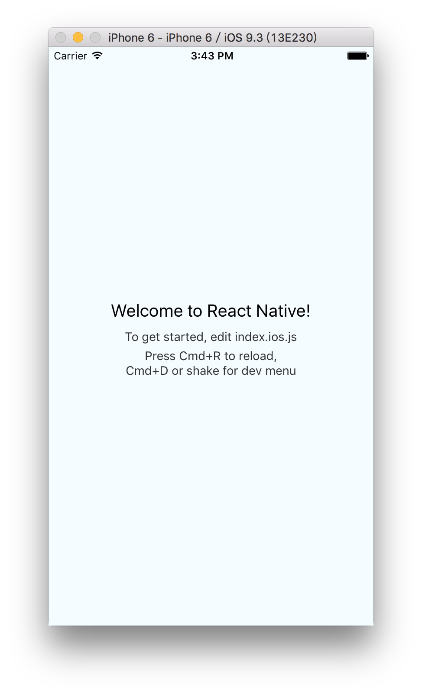

### 這是一個 React-Native 練習專案

練習畫面截圖：

初始畫面

畫面修改

### 問題 & 解決

- 下 `react-native run-ios` 指令，遇到 `Command `run-ios` unrecognized.` 訊息

可以參考以下這篇[stackoverflow](http://stackoverflow.com/questions/36119358/react-native-command-run-ios-unrecognized)
